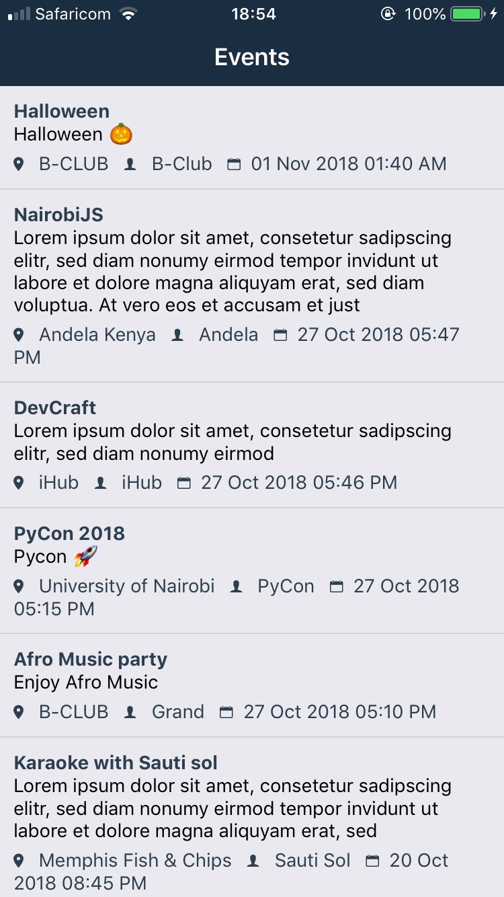
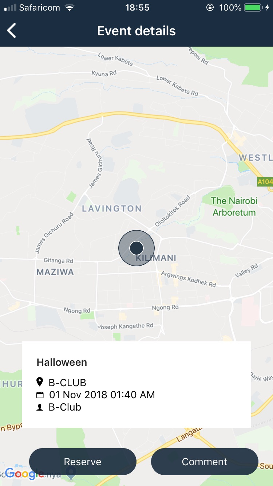
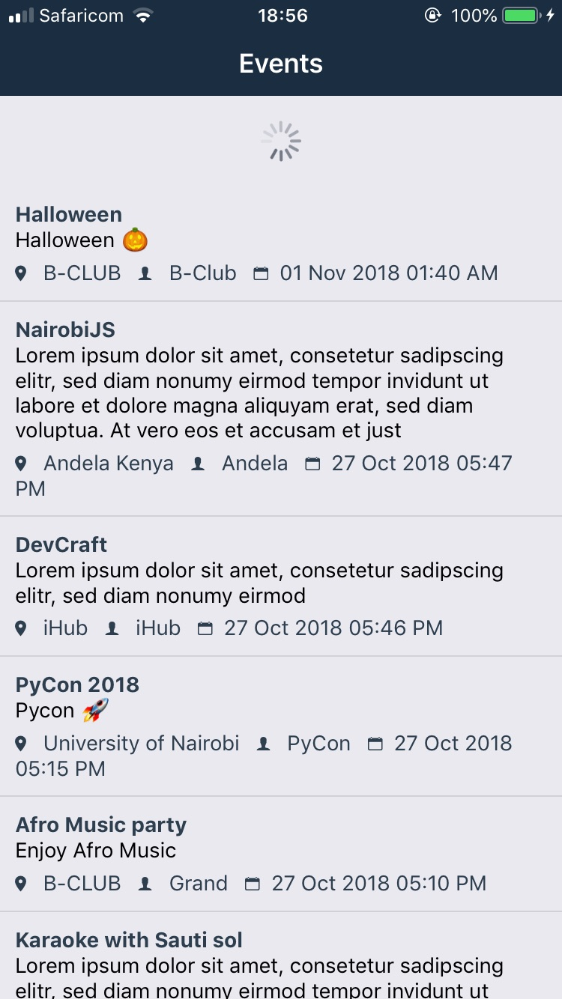
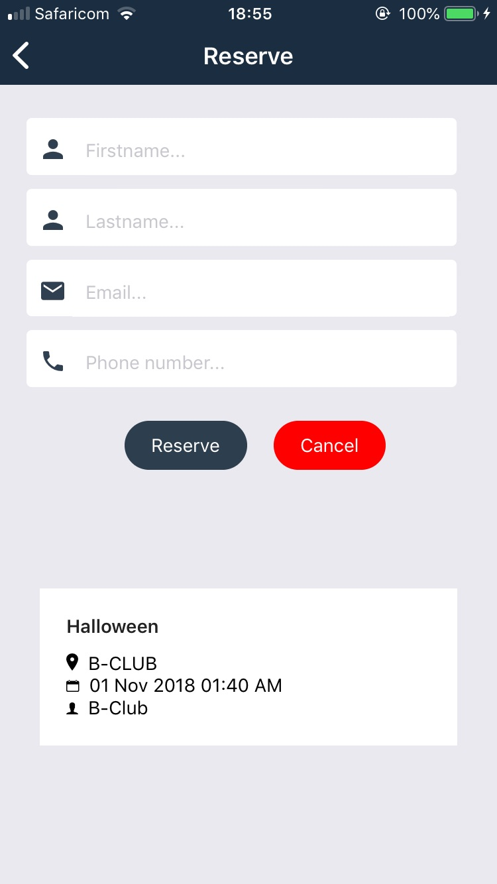

# EventLocator
[](https://www.codacy.com/app/muhozi/EventLocator?utm_source=github.com&amp;utm_medium=referral&amp;utm_content=muhozi/EventLocator&amp;utm_campaign=Badge_Grade)

This is a simple mobile ios and android mobile application(ios & android) for locating events on the map. It is built with react native.

|  |  |  |
| ------------------------------------------------------------ | ------------------------------------------------------------ | ------------------------------------------------------------ |
|  |  |  |


## How it works

This application fetches events added via EventLocator web (http://eventlocate.herokuapp.com) then list them. Within the app you can view event details including location on the map. You can also send a comment and reserve. For demo video of how it works check this link: https://www.youtube.com/watch?v=k9olKTfmVHw

## Try out the application

Set up the environment to run react native applications. For more check [here](https://facebook.github.io/react-native/docs/getting-started.html).

#### Clone the repo

```bash
git clone git@github.com:muhozi/EventLocator.git
```

```bash
cd EventLocator
```


### Install

```bash
yarn
```

### ios

For *ios* you need to have a MacBook with Xcode and [Cocoapods](https://guides.cocoapods.org/using/getting-started.html) installed. Follow the following steps

**Install ios native dependencies with cocoapods**

```bash
cd ios
```

```bash
pod install
```

Open `EventLocator.xcworkspace` in Xcode(it is located in `ios` folder) and run the app from from Xcode.

You can also run `react-native run-ios` from project home directory.

#### Android

On android you just need to run `react-native run-android`. Make sure you have an android device connected (or Emulator)

# Author

[Emery Muhozi](https://twitter.com/EmeryMuhozi)

